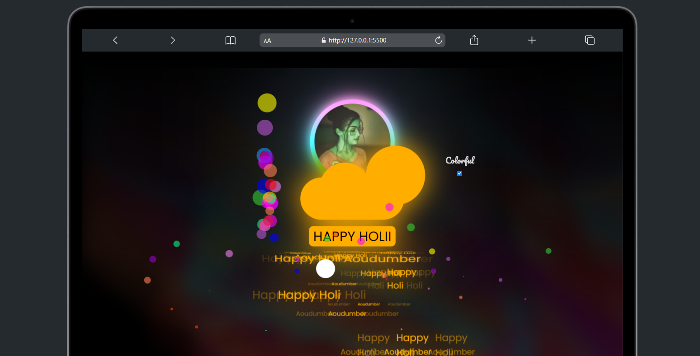

# 🎨 Holi Magic Wish: A Digital Festival of Colors

**Make Holi unforgettable** with this interactive website that blends **technology, creativity, and festive joy!** Perfect for sending a unique, techy-romantic Holi wish in 2025! 💻❤️

---

## 🌟 Live Demo
👉 **Experience the magic now:** [Click Here](https://holi-magic-wish.netlify.app)



---

## ✨ Features that Bring Holi to Life!

- 🎊 **Raining Holi Messages** – Watch "Happy Holi" texts shower from animated clouds! ☁️🌈  
- 🫧 **Interactive Bubble Generator** – Rotate the magic circle to create colorful bubbles! 🟣🔵🟠  
- 🖼️ **Animated Photo Frame** – A smooth, customizable circular frame to add your favorite Holi moments!  
- 📱 **Mobile-Friendly** – Enjoy a seamless experience on all devices!  
- 🎨 **100% Customizable** – Change photos, colors, and messages in just 2 minutes!

---

## 🚀 Quick Start Guide

💻 **Clone the Repository**:
```bash
 git clone https://github.com/aoudumber-bade/holi-magic-wish.git
```
📂 **Run the Project**: Open `index.html` in your browser!

---

## 🔧 Tech Stack

- 🖥️ **Frontend**: HTML5, CSS3 (Animations), Vanilla JavaScript  
- 🎨 **Design**: CSS Keyframes, SVG Filters  
- 🌍 **Hosting**: Netlify

---

## 🤝 Contribute & Spread the Holi Cheer!

🌟 Want to enhance the magic? Follow these steps:
1. **Fork this repository**
2. **Create a new branch**: `git checkout -b feature/amazing-feature`
3. **Commit your changes**: `git commit -m 'Added some Holi magic!'`
4. **Push your changes**: `git push origin feature/amazing-feature`
5. **Open a Pull Request!** 🚀

---

## 📜 License

📝 **MIT License** – Feel free to use, remix, and spread Holi joy in your own way!

💖 Made with love by **Aoudumber Bade** 💖

